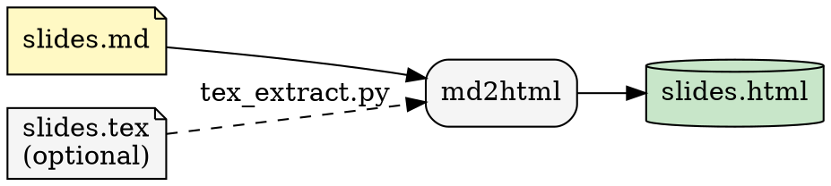
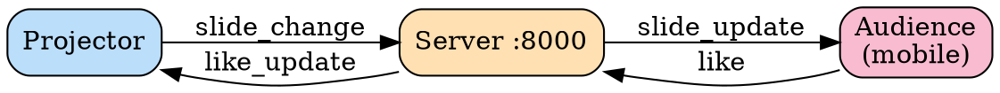

# deck-lovers — Interactive AI Presentation System

Custom HTML slide deck with live audience engagement via WebSocket.
Audience members open a mobile companion page, follow along, and send likes
that animate in real time on the projector view.

No Reveal.js. No frameworks. Pure HTML/CSS/JS generated from Markdown.

---

## 1. Architecture

### Conversion pipeline



### Runtime WebSocket topology



---

## 2. Slide format (`slides.md`)

Slides are plain Markdown separated by `---` on its own line.

```markdown
# Title slide
**subtitle**
*Author · Date*

---

## Content slide

- Bullet with **bold** and _italic_
- Emoji work fine 🚀

> blockquote

---

## Table

| Col A | Col B |
|-------|-------|
| x     | y     |

---

## Checklist

- [x] Done item
- [ ] Todo item

---

## Code

    ```python
    print("hello")
    ```

---

## YouTube embed

!youtube[Video title](https://www.youtube.com/watch?v=VIDEO_ID)

---
```

**Slide types:**
- A slide starting with `# Heading` → title style (centered, gradient background)
- A slide starting with `## Heading` → content style (left-aligned, accent underline)

**Stats slide** is auto-appended as the last slide — shows a live bar chart of likes per slide.

---

## 3. Running

### Full workflow (auto-detects WiFi IP)

```bash
./deploy.sh
```

This:
1. Detects `podman compose` or `docker compose`
2. Detects your WiFi IP (macOS `en0`/`en1`, Linux `ip addr`) — bakes it into the QR code
3. Converts `slides.md` → `output/slides.html`
4. Starts the server

### Override IP or runtime

```bash
# Both in one command
COMPOSE="podman compose" SERVER_HOST=192.168.0.106 ./deploy.sh

# Convert only (no server)
./deploy.sh --convert-only

# Server only (skip conversion)
./deploy.sh --serve-only
```

### Re-convert without restarting the server

```bash
./deploy.sh --convert-only
# Server auto-reloads on next browser refresh (reads slides.html from ./output/)
```

### Rebuild images after code changes

```bash
podman compose build md2html
podman compose build server
```

---

## 4. Input: Markdown only (no LaTeX)

Put your content directly in `slides.md` at the project root.
Run `./deploy.sh` — the script copies it to `output/slides.md` automatically
when `source/slides.tex` is empty.

---

## 5. Input: LaTeX source

Place your Beamer file at `source/slides.tex`.
`deploy.sh` detects it is non-empty and runs `tex_extract.py` first,
writing `output/slides.md`, which `md2html.py` then converts.

**Expected cleanup** after `tex_extract.py`:

| LaTeX residual | Target Markdown |
|---|---|
| `\begin{itemize}` / `\item` | `- ` bullets |
| `\textbf{x}` / `\textit{x}` | `**x**` / `_x_` |
| `\begin{equation}` | `$$ … $$` |
| `\includegraphics{f}` | `` or remove |
| `\begin{frame}{Title}` | `## Title` |

---

## 6. Output files (`output/`)

All generated files land on the host in `./output/`:

```
output/
├── slides.md          ← intermediate Markdown (editable)
└── slides.html        ← final standalone deck (open directly in browser)
```

`slides.html` is fully self-contained — open it with `file://` for offline use,
or serve it via the FastAPI server for live audience features.

---

## 7. QR code and network

| Scenario | `SERVER_HOST` |
|---|---|
| Local dev | `localhost` (default) |
| LAN / in-person | `192.168.x.x` (auto-detected by `convert.sh`) |
| Reverse proxy | `slides.example.com` |

Find your LAN IP manually:

```bash
# macOS
ipconfig getifaddr en0

# Linux
ip -4 addr show | grep -oP '(?<=inet\s)\d+(\.\d+){3}' | grep -v 127
```

> **HTTPS note:** QR code uses `http://`. Behind TLS, set `WS_SCHEME=wss`
> and ensure the proxy forwards WebSocket upgrade headers.

---

## 8. Running bare (no containers)

```bash
pip install -r requirements.txt

# Convert
cp slides.md output/slides.md
SERVER_HOST=localhost python md2html.py \
  --input output/slides.md \
  --output output/slides.html

# Serve
WORKSPACE_PATH=./output uvicorn server:app --host 0.0.0.0 --port 8000
```

---

## 9. SELinux (Fedora / RHEL)

On SELinux-enforcing systems add `:Z` to bind mounts in `docker-compose.yml`:

```yaml
tex2md:
  volumes:
    - ./source:/source:ro,Z
    - ./output:/workspace:Z
```

---

## 10. Auto-start with systemd — Quadlet (Podman ≥ 4.4)

`~/.config/containers/systemd/presentation.container`:

```ini
[Container]
Image=localhost/deck-lovers_server:latest
PublishPort=8000:8000
Volume=%h/deck-lovers/output:/app/workspace:Z
Environment=WORKSPACE_PATH=/app/workspace

[Service]
Restart=always

[Install]
WantedBy=default.target
```

```bash
systemctl --user daemon-reload
systemctl --user enable --now presentation.container
```

---

## 11. Presenter workflow

1. Edit `slides.md` (or put `slides.tex` in `source/`)
2. `./deploy.sh` — converts + starts server, shows all endpoints
3. Open `http://<IP>:8000` on projector machine → F11 fullscreen
4. Show QR code (bottom-left) to audience
5. Navigate with ← → arrow keys
6. Watch likes sidebar on the right
7. Navigate to last slide for the engagement bar chart

---

## 12. Extending

### Add a slide

Add a new `---` section to `slides.md`, then `./deploy.sh --convert-only`.

### Change the like mechanic

In `audience.html`, add a cooldown to the click handler:

```javascript
var lastLike = 0;
likeBtn.addEventListener('click', function () {
    if (Date.now() - lastLike < 2000) return;
    lastLike = Date.now();
    // ... rest of handler
});
```

### Persist likes across sessions

In `server.py` on startup/shutdown:

```python
LIKES_FILE = WORKSPACE / "likes.json"

def save_likes():
    LIKES_FILE.write_text(json.dumps(likes))

def load_likes():
    global likes
    if LIKES_FILE.exists():
        likes = {int(k): v for k, v in json.loads(LIKES_FILE.read_text()).items()}
```

### Custom slide backgrounds

Add an HTML comment to any slide in `slides.md`:

```markdown
## My Slide

<!-- style="background: linear-gradient(135deg,#1a2333,#2c3e50)" -->

Content here.
```

Then extend `md2html.py` to parse and apply the comment as an inline style on the slide `<div>`.

---

## 13. Remote deployment (Hetzner VPS)

Use `deploy.sh` to present from a public server — no venue WiFi dependency.

### First-time VPS setup

```bash
# Bootstrap: installs podman, syncs project files, builds images
VPS=root@YOUR_SERVER_IP ./deploy.sh --setup
```

### Deploy and present

```bash
# Convert locally (bakes VPS IP into QR), push slides.html, restart server
VPS=root@YOUR_SERVER_IP ./deploy.sh
```

### Flags

```bash
# Push slides only — no server restart
VPS=root@YOUR_SERVER_IP ./deploy.sh --convert-only

# Restart server only — no re-conversion
VPS=root@YOUR_SERVER_IP ./deploy.sh --serve-only

# Custom SSH port
VPS_PORT=2222 VPS=root@YOUR_SERVER_IP ./deploy.sh
```

Local mode still works without `VPS`:

```bash
./deploy.sh          # same as ./convert.sh
```

### Hetzner firewall

Open port 8000 in the **Hetzner Cloud Console** → your server → **Firewalls → Add Rule**:

| Direction | Protocol | Port | Source      |
|-----------|----------|------|-------------|
| Inbound   | TCP      | 8000 | `0.0.0.0/0` |

Or via `ufw` on the server:

```bash
ufw allow 8000/tcp
ufw reload
```

Audience URL: `http://YOUR_SERVER_IP:8000/audience`
