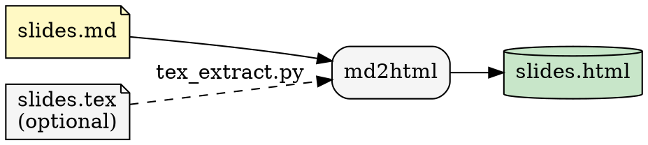
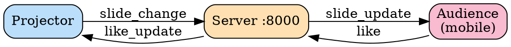

# deck-lovers — Interactive AI Presentation System

<p align="center">
  
</p>

<p align="center">
  <a href="https://github.com/carlok/deck-lovers/actions/workflows/ci.yml"></a>
  <a href="https://github.com/carlok/deck-lovers/releases"></a>
  <a href="LICENSE"></a>
</p>

Custom HTML slide deck with live audience engagement via WebSocket.
Audience members open a mobile companion page, follow along, and send likes
that animate in real time on the projector view.

No Reveal.js. No frameworks. Pure HTML/CSS/JS generated from Markdown.

---

## Quickstart (60 seconds)

```bash
cp .env.example .env
# set a real projector password in .env
./deploy.sh
```

Then open:
- Projector: `http://<LAN-IP>:8000`
- Audience: `http://<LAN-IP>:8000/audience`

Host remains clean:
- no host `npm install`
- no host Python `venv`
- all conversion, serving, and tests run in Podman containers

For internals and component map, see `ARCHITECTURE.md`.

---

## 1. Architecture

### Conversion pipeline



### Runtime WebSocket topology



---

## 2. Slide format (`slides.md`)

Slides are plain Markdown separated by `---` on its own line.

```markdown
# Title slide
**subtitle**
*Author · Date*

---

## Content slide

- Bullet with **bold** and _italic_
- Emoji work fine 🚀

> blockquote

---

## Table

| Col A | Col B |
|-------|-------|
| x     | y     |

---

## Checklist

- [x] Done item
- [ ] Todo item

---

## Code

    ```python
    print("hello")
    ```

---

## YouTube embed

!youtube[Video title](https://www.youtube.com/watch?v=VIDEO_ID)

---
```

**Slide types:**
- A slide starting with `# Heading` → title style (centered, gradient background)
- A slide starting with `## Heading` → content style (left-aligned, accent underline)

**Stats slide** is auto-appended as the last slide — shows a live bar chart of likes per slide.

---

## 3. Running

### Case A — Local, plain HTTP (default)

Best for trusted LAN / in-person use. No certs, no port-forwarding.

```bash
./deploy.sh
```

1. Uses `podman compose`
2. Detects your WiFi IP (macOS `en0`/`en1`, Linux `ip addr`) — bakes it into the QR code
3. Converts `slides.md` → `output/slides.html`
4. Starts the server at `http://<LAN-IP>:8000`

Audience scan the QR code and open `http://<LAN-IP>:8000/audience` on their phones.

---

### Case B — Local, HTTPS on `localhost` (presenter only)

Useful when you need `wss://` (e.g. your browser blocks mixed content).
Caddy issues a `tls internal` self-signed cert — Chrome trusts `localhost` natively,
no CA install needed.

```bash
./deploy.sh --https
```

- Projector browser: `https://localhost`
- Audience on same LAN: `http://<LAN-IP>:8000/audience` (plain HTTP — still works)

---

### Case C — Any public cloud VM (Hetzner, DigitalOcean, AWS EC2, …)

Real ACME cert via [sslip.io](https://sslip.io) — no domain purchase required.
Ports **80** and **443** must be open on the VM.

```bash
# First time: bootstrap VM (installs podman, syncs files, builds images)
VPS=root@YOUR_SERVER_IP ./deploy.sh --setup

# Every subsequent run
VPS=root@YOUR_SERVER_IP ./deploy.sh
```

The hostname `1.2.3.4` → `1-2-3-4.sslip.io` is auto-computed.
Caddy obtains the cert and audience URL becomes `https://1-2-3-4.sslip.io/audience`.

---

### Other flags

```bash
# Convert only (no server restart)
./deploy.sh --convert-only

# Server only (skip conversion)
./deploy.sh --serve-only

# Override runtime or hostname
COMPOSE="podman compose" SERVER_HOST=192.168.0.106 ./deploy.sh

# Custom SSH port for remote
VPS_PORT=2222 VPS=root@YOUR_SERVER_IP ./deploy.sh
```

### Rebuild images after code changes

```bash
podman compose build md2html
podman compose build server
```

---

## 4. Input: Markdown only (no LaTeX)

Put your content directly in `slides.md` at the project root.
Run `./deploy.sh` — the script copies it to `output/slides.md` automatically
when `source/slides.tex` is empty.

---

## 5. Input: LaTeX source

Place your Beamer file at `source/slides.tex`.
`deploy.sh` detects it is non-empty and runs `tex_extract.py` first,
writing `output/slides.md`, which `md2html.py` then converts.

**Expected cleanup** after `tex_extract.py`:

| LaTeX residual | Target Markdown |
|---|---|
| `\begin{itemize}` / `\item` | `- ` bullets |
| `\textbf{x}` / `\textit{x}` | `**x**` / `_x_` |
| `\begin{equation}` | `$$ … $$` |
| `\includegraphics{f}` | `` or remove |
| `\begin{frame}{Title}` | `## Title` |

---

## 6. Output files (`output/`)

All generated files land on the host in `./output/`:

```
output/
├── slides.md          ← intermediate Markdown (editable)
└── slides.html        ← final standalone deck (open directly in browser)
```

`slides.html` is fully self-contained — open it with `file://` for offline use,
or serve it via the FastAPI server for live audience features.

---

## 7. QR code and network

| Scenario | `SERVER_HOST` | `WS_SCHEME` | Command |
|---|---|---|---|
| Local dev / in-person LAN | `192.168.x.x` (auto-detected) | `ws` | `./deploy.sh` |
| Local HTTPS (presenter only) | `localhost` | `wss` | `./deploy.sh --https` |
| Any cloud VM, no domain | `1-2-3-4.sslip.io` (auto) | `wss` | `VPS=… ./deploy.sh` |
| Any cloud VM, custom domain | `slides.example.com` | `wss` | `WS_SCHEME=wss SERVER_HOST=… VPS=… ./deploy.sh` |

Find your LAN IP manually:

```bash
# macOS
ipconfig getifaddr en0

# Linux
ip -4 addr show | grep -oP '(?<=inet\s)\d+(\.\d+){3}' | grep -v 127
```

---

## 8. HTTPS

The FastAPI server speaks plain HTTP on port 8000 internally.
Caddy sits in front and handles TLS termination, cert renewal, WebSocket
upgrade headers, and HTTP→HTTPS redirects.
**Never expose port 8000 publicly.**

### Local HTTPS (`--https`)

Uses `tls internal` (Caddy self-signed cert for `localhost`).
Chrome trusts `localhost` natively — no CA install, no port-forwarding needed.

```bash
./deploy.sh --https
# ℹ  HTTPS (local) → https://localhost  [presenter's browser only]
#    Audience on same LAN → http://<LAN-IP>:8000/audience  [HTTP, no cert needed]
```

### Cloud VM HTTPS (sslip.io — no domain needed)

`sslip.io` resolves `1-2-3-4.sslip.io` to `1.2.3.4`.
Caddy obtains a real Let's Encrypt cert automatically.
Ports **80** and **443** must be open on the VM; port 8000 stays closed.

```bash
VPS=root@1.2.3.4 ./deploy.sh
# → https://1-2-3-4.sslip.io  (auto-computed)
```

With a real domain:

```bash
WS_SCHEME=wss SERVER_HOST=slides.example.com VPS=root@1.2.3.4 ./deploy.sh
```

Audience URL: `https://1-2-3-4.sslip.io/audience`

### Caddy is bundled — no host install needed

Caddy runs as a container (`profiles: ["tls"]` in `docker-compose.yml`).
`deploy.sh` starts it automatically in both `--https` and remote modes.

### nginx (alternative for cloud VM)

```nginx
server {
    listen 443 ssl;
    server_name 1-2-3-4.sslip.io;

    ssl_certificate     /etc/letsencrypt/live/1-2-3-4.sslip.io/fullchain.pem;
    ssl_certificate_key /etc/letsencrypt/live/1-2-3-4.sslip.io/privkey.pem;

    location / {
        proxy_pass         http://127.0.0.1:8000;
        proxy_http_version 1.1;
        proxy_set_header Upgrade    $http_upgrade;
        proxy_set_header Connection "upgrade";
        proxy_set_header Host              $host;
        proxy_set_header X-Real-IP         $remote_addr;
        proxy_set_header X-Forwarded-Proto https;
    }
}
```

---

## 9. Projector password

The projector page (`/`) is password-protected to prevent accidental slide
navigation by audience members.

| Env var | Default | Effect |
|---|---|---|
| `PROJECTOR_PASSWORD` | `changeme` | Password shown on login form (change before public use) |
| `PROJECTOR_PASSWORD=""` | *(unset)* | Disables protection entirely |

Set it in a `.env` file at the project root (already in `.gitignore`):

```bash
# .env
PROJECTOR_PASSWORD=mysecretword
```

Never keep `PROJECTOR_PASSWORD=changeme` in production/public deployments.

Docker Compose picks it up automatically. Or pass it inline:

```bash
PROJECTOR_PASSWORD=mysecretword ./deploy.sh
```

The audience page (`/audience`) is never protected — anyone can follow along.

Copy `.env.example` to `.env` at the project root to configure all options:

```bash
cp .env.example .env
# edit .env with your values
```

`.env` is in `.gitignore` — never commit real credentials.

---

## 10. Running bare (no containers)

```bash
pip install -r converter/requirements.txt
pip install -r server/requirements.txt

# Convert
mkdir -p output && cp slides.md output/slides.md
SERVER_HOST=localhost python converter/md2html.py \
  --input output/slides.md \
  --output output/slides.html

# Serve
WORKSPACE_PATH=./output uvicorn server.server:app --host 0.0.0.0 --port 8000
```

---

## 11. SELinux (Fedora / RHEL)

On SELinux-enforcing systems add `:Z` to bind mounts in `docker-compose.yml`:

```yaml
tex2md:
  volumes:
    - ./source:/source:ro,Z
    - ./output:/workspace:Z
```

---

## 12. Auto-start with systemd — Quadlet (Podman ≥ 4.4)

`~/.config/containers/systemd/presentation.container`:

```ini
[Container]
Image=localhost/deck-lovers_server:latest
PublishPort=8000:8000
Volume=%h/deck-lovers/output:/app/workspace:Z
Environment=WORKSPACE_PATH=/app/workspace

[Service]
Restart=always

[Install]
WantedBy=default.target
```

```bash
systemctl --user daemon-reload
systemctl --user enable --now presentation.container
```

---

## 13. Presenter workflow

1. Edit `slides.md` (or put `slides.tex` in `source/`)
2. `./deploy.sh` — converts + starts server, shows all endpoints
3. Open `http://<IP>:8000` on projector machine → F11 fullscreen
4. Show QR code (bottom-left) to audience
5. Navigate with ← → arrow keys
6. Watch likes sidebar on the right
7. Navigate to last slide for the engagement bar chart

---

## 14. Extending

### Add a slide

Add a new `---` section to `slides.md`, then `./deploy.sh --convert-only`.

### Change the like mechanic

In `server/src/audience.js`, add a cooldown to the click handler:

```javascript
var lastLike = 0;
likeBtn.addEventListener('click', function () {
    if (Date.now() - lastLike < 2000) return;
    lastLike = Date.now();
    // ... rest of handler
});
```

### Persist likes across sessions

In `server/server.py` on startup/shutdown:

```python
LIKES_FILE = WORKSPACE / "likes.json"

def save_likes():
    LIKES_FILE.write_text(json.dumps(likes))

def load_likes():
    global likes
    if LIKES_FILE.exists():
        likes = {int(k): v for k, v in json.loads(LIKES_FILE.read_text()).items()}
```

### Custom slide backgrounds

Add an HTML comment to any slide in `slides.md`:

```markdown
## My Slide

<!-- style="background: linear-gradient(135deg,#1a2333,#2c3e50)" -->

Content here.
```

Then extend `converter/md2html.py` to parse and apply the comment as an inline style on the slide `<div>`.

---

## 15. Remote deployment (any cloud VM)

Works on Hetzner, DigitalOcean, AWS EC2, Linode, etc. — any Ubuntu/Fedora VM
with a public IP and ports 80 + 443 open.

### First-time setup

```bash
# Installs podman on the VM, syncs project files, builds images
VPS=root@YOUR_SERVER_IP ./deploy.sh --setup
```

### Deploy and present

```bash
# Converts locally, pushes slides.html, restarts server + Caddy
VPS=root@YOUR_SERVER_IP ./deploy.sh
# → https://1-2-3-4.sslip.io  (auto-computed from your IP)
```

### Firewall

Open **80** and **443** only. Keep 8000 closed — Caddy proxies everything.

```bash
# ufw on the VM
ufw allow 80/tcp
ufw allow 443/tcp
ufw deny 8000/tcp
ufw reload
```

On Hetzner: Cloud Console → your server → **Firewalls → Add Rule** for TCP 80 and 443.

### Custom domain

```bash
WS_SCHEME=wss SERVER_HOST=slides.example.com VPS=root@YOUR_SERVER_IP ./deploy.sh
```

---

## 16. Dependencies & credits

> **No Reveal.js.** The slide deck is plain HTML/CSS/JS generated by `converter/md2html.py`.

### Python

Split per service — no shared root `requirements.txt`.

| File | Package | Role |
|------|---------|------|
| `converter/requirements.txt` | [Markdown](https://python-markdown.github.io) | Markdown → HTML in `md2html.py` |
| `server/requirements.txt` | [FastAPI](https://fastapi.tiangolo.com) | HTTP + WebSocket server |
| `server/requirements.txt` | [uvicorn](https://www.uvicorn.org) | ASGI runner |
| `server/requirements.txt` | [websockets](https://websockets.readthedocs.io) | WebSocket transport |

### JavaScript (CDN, no `package.json` needed)

| Library | Version | CDN | Role |
|---------|---------|-----|------|
| [Font Awesome](https://fontawesome.com) | 6.5.2 | cdnjs | Icon set (`<i class="fa-...">`) |
| [QRCode.js](https://github.com/davidshimjs/qrcodejs) | 1.0.0 | cdnjs | QR code in projector view |
| [highlight.js](https://highlightjs.org) | 11.9.0 | cdnjs | Syntax highlighting for code blocks |
| [MathJax](https://www.mathjax.org) | 3.x | jsDelivr | LaTeX math via `$...$` / `$$...$$` |
| [viz.js](https://github.com/mdaines/viz-js) | 2.1.2 | cdnjs | Graphviz `dot` diagrams → inline SVG |
