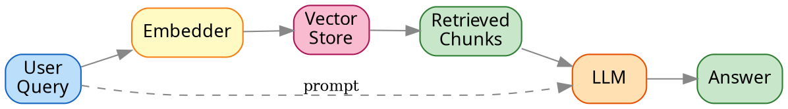

# 🤖 Large Language Models in 2026
**A practical introduction for engineers**

*Carlo Rossi · March 2026*

---

## What is an LLM?

- Trained on **hundreds of billions** of tokens from the open web
- Predicts the next token given a context window
- Emergent capabilities arise from scale 🌱
- Core architecture: the **Transformer** (Vaswani et al., 2017)
- Not "just autocomplete" — but kind of 😄

> "The models we thought were plateauing
> turned out to be just warming up."

---

## Model landscape 2026

| Model | Context | Strength |
|-------|---------|----------|
| Claude Opus 4.6 | 200k tokens | Reasoning, long docs |
| GPT-4o | 128k tokens | Speed, vision |
| Gemini 2.0 Ultra | 1M tokens | Multimodal |
| Llama 3.3 70B | 128k tokens | Open weights, cost |
| Mistral Large 2 | 128k tokens | EU compliance |

---

## Production checklist ✅

- [x] Define success metrics *before* you start
- [x] Evaluate on your actual data distribution
- [x] Set up tracing and observability
- [ ] Define fallback for model failures
- [ ] Cost and latency budget per request
- [ ] Privacy review — what enters the context?

---

## Quick start: Claude API

```python
import anthropic

client = anthropic.Anthropic()

msg = client.messages.create(
    model="claude-opus-4-6",
    max_tokens=1024,
    system="You are a helpful assistant.",
    messages=[{"role": "user", "content": "Hello! 👋"}]
)

print(msg.content[0].text)
# → Hello! How can I help you today?
```

---

## The math behind attention

Scaled dot-product attention — the core of every Transformer:

$$\text{Attention}(Q,K,V) = \text{softmax}\!\left(\frac{QK^T}{\sqrt{d_k}}\right)V$$

Softmax turns raw scores into a probability distribution over tokens:

$$\text{softmax}(x_i) = \frac{e^{x_i}}{\sum_{j} e^{x_j}}$$

The $\sqrt{d_k}$ scaling prevents gradients from vanishing when $d_k$ is large.
Multi-head attention runs $h$ parallel heads and concatenates: $\text{MH} = \text{Concat}(\text{head}_1,\dots,\text{head}_h)\,W^O$

---

## Understanding attention

!youtube[3Blue1Brown — But what is a GPT?](https://www.youtube.com/watch?v=wjZofJX0v4M)

Visual intuition for self-attention in ~30 minutes.

---

## RAG pipeline



---

## Key risks ⚠️

1. **Hallucination** — fluent, confident, wrong
2. **Prompt injection** — adversarial inputs hijack behavior
3. **Data leakage** — PII in context windows and logs
4. **Sycophancy** — models that agree too readily
5. **Evaluation gaps** — benchmarks ≠ production quality

Learn more: [arxiv.org/abs/2307.09009](https://arxiv.org/abs/2307.09009)

---

## Connect

<div class="icon-links">
  <a class="icon-link" href="https://github.com/username">
    <i class="fa-brands fa-github"></i>
    <span>github.com/username</span>
  </a>
  <a class="icon-link" href="https://example.com">
    <i class="fa-solid fa-globe"></i>
    <span>example.com</span>
  </a>
  <a class="icon-link" href="https://linkedin.com/in/username">
    <i class="fa-brands fa-linkedin"></i>
    <span>linkedin.com/in/username</span>
  </a>
  <div class="icon-link icon-qr">
    
    <span>Contact form</span>
  </div>
</div>

---

## Open questions 🔭

- How do we measure **real understanding** vs pattern matching?
- Is inference-time compute the next scaling frontier?
- What does **responsible deployment** look like at scale?
- When do LLMs become **agents**, and what changes?

### Let's discuss! 💬

*Scan the QR → tap ❤️ on slides you want to revisit*
